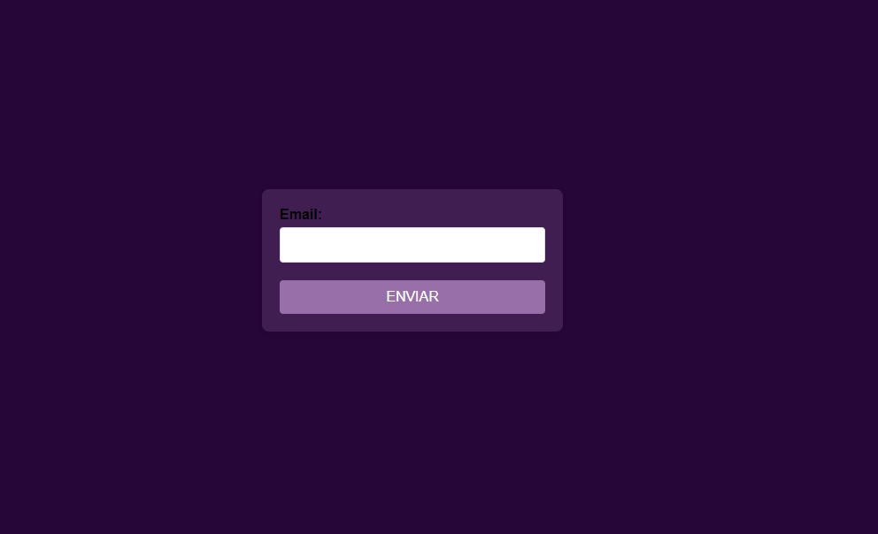
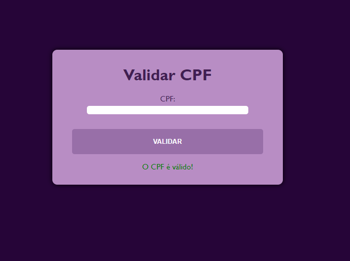

# Validação de CPF e Email

*Disciplina:* Desensivolvimento Web

*Professor*: [Leonardo Santiago Sidon da Rocha](https://github.com/LeonardoRochaMarista/)

Este repositório contém dois scripts JavaScript para validação de CPF e email que aprendemos em aula com o professor `Leonardo Rocha`. Abaixo está uma explicação detalhada de como cada script funciona.

O script de validação de CPF adiciona um escutador de evento ao formulário de CPF e valida o CPF quando o formulário é enviado.

# Validação de Email

Script (email.js)
O script de validação de email contém quatro funções principais para verificar se o email é válido quando o campo perde o foco e se o campo de email está preenchido quando o formulário é enviado.

1. A função checarEmail é chamada quando o campo de email perde o foco.

2. Verifica se o email contém os caracteres `@ ` e `.` e se não está vazio.

3. Exibe uma mensagem indicando se o email é válido ou inválido.

4. A função verifica é chamada quando o formulário é enviado, verificando se o campo de email não está vazio.

# Validação de CPF

Script (`cpf.js`)

O script de validação de CPF adiciona um escutador de evento ao formulário de CPF e valida o CPF quando o formulário é enviado. 

1. O escutador de evento é adicionado ao formulário com ID `cpfForm.`

2. Quando o formulário é enviado, a função validarCPF é chamada para verificar a validade do CPF.

3. A função `validarCPF` remove caracteres não numéricos, verifica o comprimento e se todos os dígitos são iguais.

4. Em seguida, valida os dois dígitos verificadores do CPF.

5. Exibe uma mensagem indicando se o CPF é válido ou inválido.

# TECNOLÓGIAS 
* `HTML`
* `CSS`
* `JAVASCRIPT`
* `GO LIVE`
* `GITHAB`

# AUTOR
* `GEOVANA APARECIDA DE LIMA`
* `LEONARDO ROCHA` 
